#部署：CentOS环境部署之系统安装
（*因为公司的电脑是正版系统并且升级到了Win10，并且这也应该是很多使用者的需求，所以这里直接记录Win10和CentOS7的双系统安装）


### 安装说明

**系统安装：**Windows10+CentOS7双系统

**安装方式：**U盘安装

**引导方式：**grub引导（即在CentOS7中进行引导，而不是Window10中进行引导）

**系统环境：**CentOS7最小安装（后面还要学习各种配置，所以直接从最小开始）

**特殊声明：**因为是直接系统安装而不是虚拟机，所以为了文档图片的效果，所有图片均来自网络（图片大多来源于[这里](http://www.cnblogs.com/xiaoyao-lxy/p/5561728.html)，并且这里是我主要参考安装方法的地方）


### 准备工作

1. 一台安装了Windows10的PC，并通过网线连接到了网络（这里略过了Windows10的安装啦！）
2. 一个U盘，容量最好8G以上
3. 安装文件：CentOS-7-x86_64-DVD-1611.iso（这个是我安装时的版本，[官方下载地址](https://www.centos.org/download/)）
4. 需要的软件：UltraISO（试用版也OK，[官方下载地址](https://cn.ultraiso.net/xiazai.html)）


### 第一步：Windows10中的准备

#### 1、为Linux分出磁盘空间

我们需要分配出一块磁盘空间给CentOS来安装运行，因为Linux和Windows的存储格式完全不同。通过Windows10的磁盘管理来处理。

在“**文件资源管理器**”中右键单击“**此电脑**”，选择“**管理**”；进入计算机管理后，选择“**磁盘管理**”

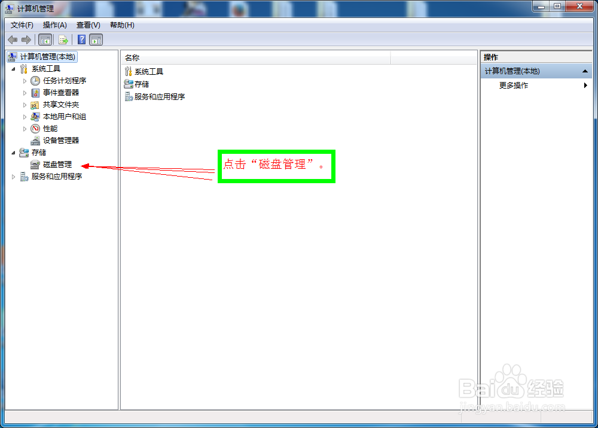

###### 方法一：直接删除卷获得空闲空间

可以删除不需要的磁盘分区，获得磁盘空闲空间。（本人公司电脑，最后个盘符没啥东西，所以用的这种方法）

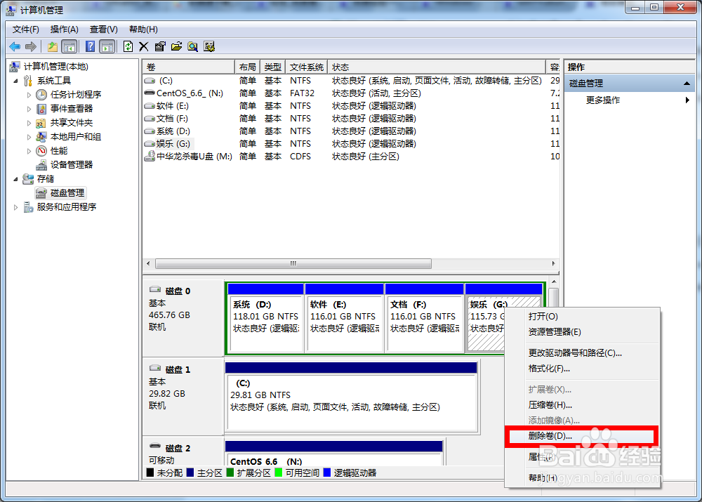

###### 方法二：压缩卷获得多余的空闲空间

如果没有不需要的分区也没关系，可以使用磁盘管理的压缩卷功能移动出多余的空闲空间。

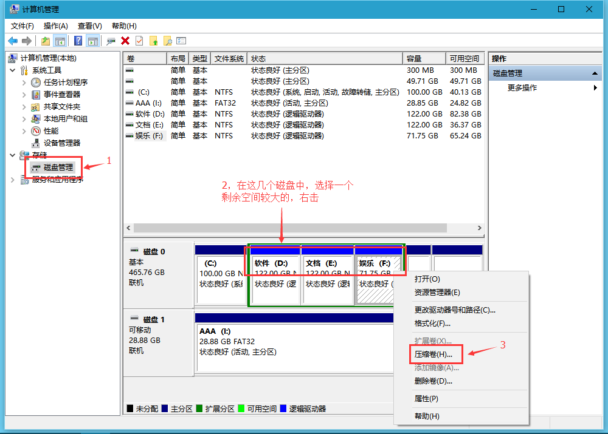

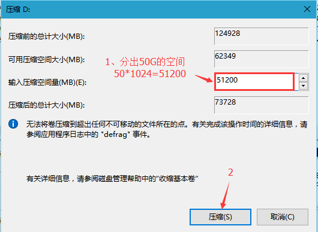

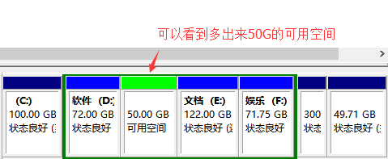


#### 2、记录下系统的网络设置

这点只是提醒一下，安装好CentOS以后最好连接好网络，这样最方便处理。如果你的电脑是直连网线自动获取，那么就不用这步了；本人公司电脑是固定IP设置的，还是先记下来免得返工。


### 第二步：CentOS安装U盘制作

#### 1、启动UltralSO，打开CentOS-7-x86_64-DVD-1611.iso文件

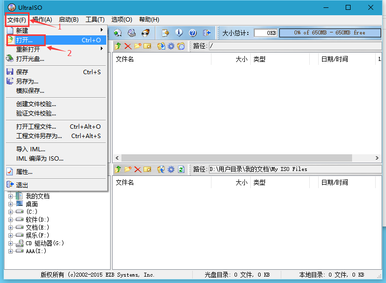

#### 2、写入U盘

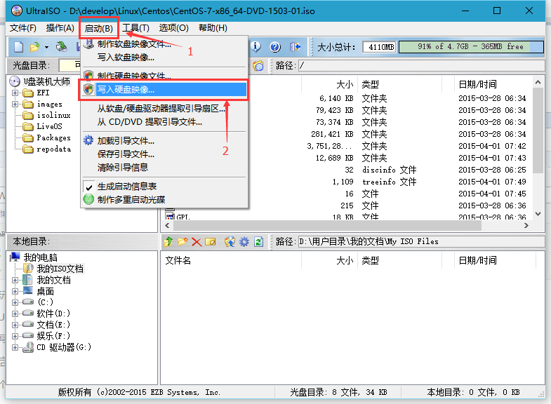

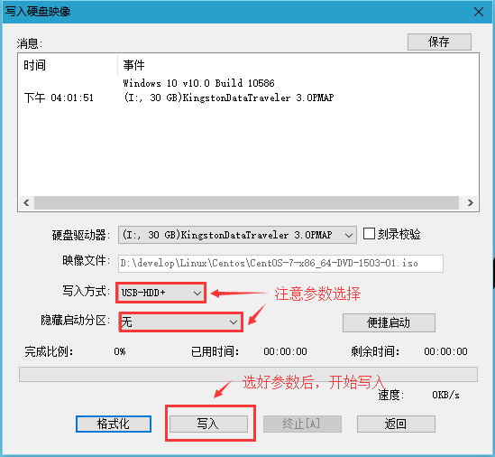

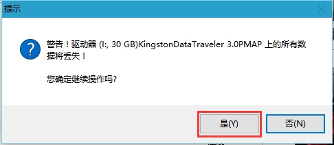

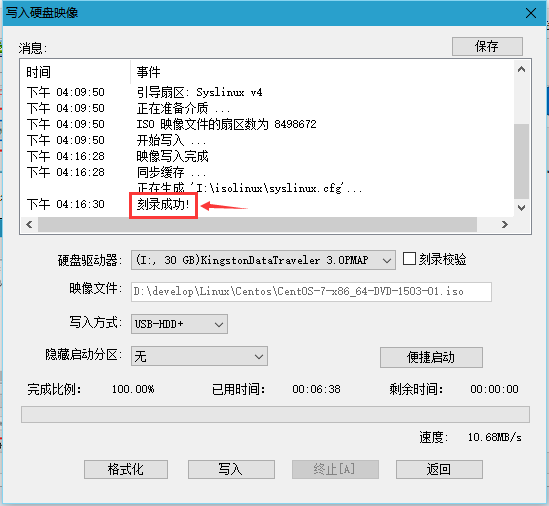


### 第三步：修改U盘引导

#### 1、进入画面

重启电脑，连点F12（个别电脑可能有不同，本人PC是联想）；选择USB HDD的那项进入画面。

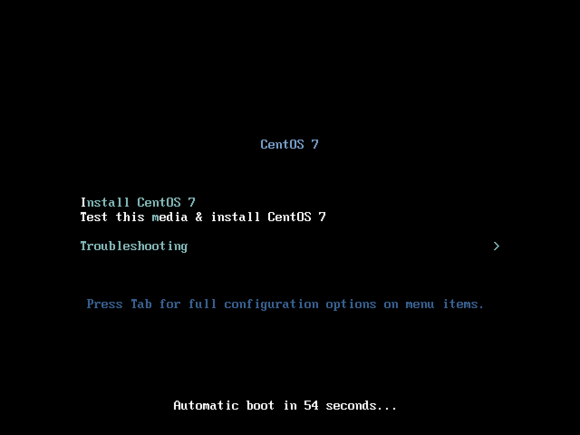

很多教程说这里要修改U盘引导的位置才行，其实我第一次直接选择了“**Install CentOS 7**”就进入安装界面了，不知道是不是此版本修复了原来的问题，还是问题出现在开始安装的时候；不过大家都说需要改，安全起见下面还是修改一下吧。

#### 2、查看U盘的位置

进入画面后，直接按Tab键，下面会显示如下内容：

```
>vmlinuz initrd=initrd.img inst.stage2=hd:LABEL=CentOS\x207\x20x86_64 rd.live.check quiet
```

修改为以下内容：

```
>vmlinuz initrd=initrd.img linux dd quiet
```

回车，进入下面的界面，就可以看到U盘的位置描述了

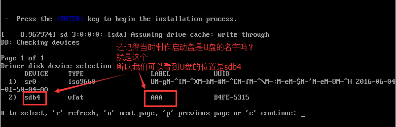

#### 3、修改U盘位置

按电脑上的电源键强制重启电脑，同样连按F12进入Boot选择“**USB HDD**”U盘启动，再次进入画面，按Tab，将底部的内容修改为如下内容（即将LABEL的内容修改为刚刚看到的固定位置sdb4，你的位置是什么就改成什么）：

```
vmlinuz initrd=initrd.img inst.stage2=hd:/dev/sdb4 quiet
```


### 第四步：安装CentOS7

这样就进入的图形安装界面了。

#### 1、选择语言

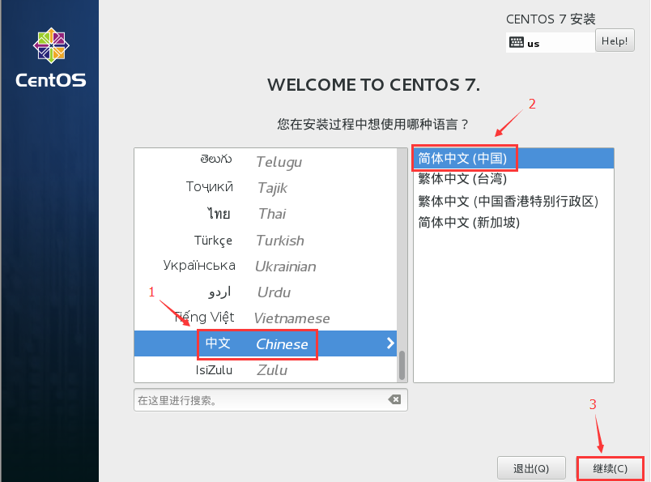

#### 2、设置安装位置

选择语言后，进入如下画面

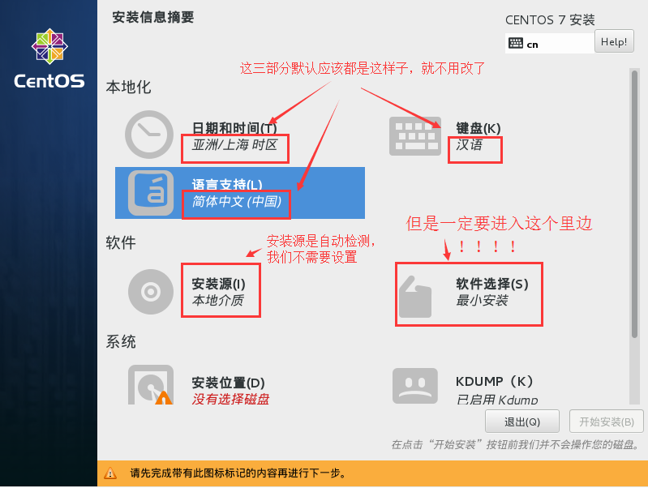

本地化里的内容不必修改；软件中的安装源是自动检测的，软件选择中可以选择系统安装的基本环境，上面说了就是要最小安装，所以这里也不用修改（想要桌面的在这里选择GNOME或者KDE都行）。

直接点击安装位置，来设置安装的磁盘。

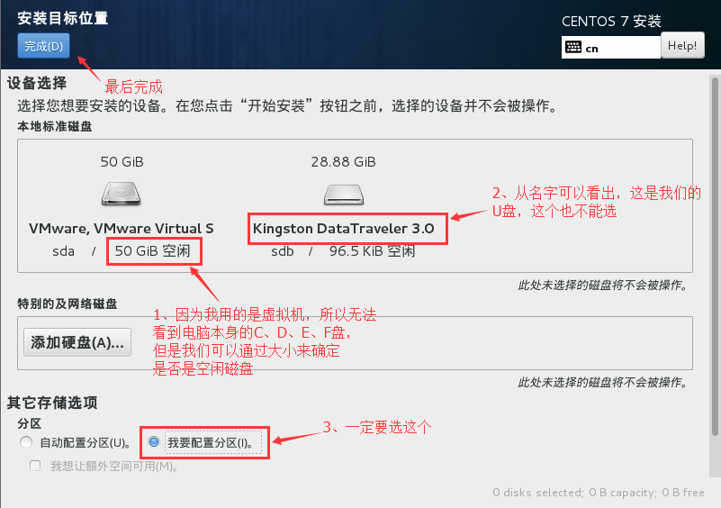

选择手动分区后，点击完成进入手动分区；直接点击“**点这里自动创建分区**”就好了，分区方案也为默认的LVM。

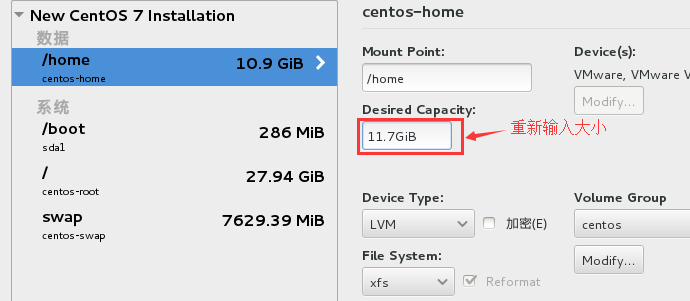

分区分好了，可以手动修改分区的大小，直接默认的就好了，然后点击完成（这里需要注意的是swap的大小，一般来说，应该是实际内存的两倍，但是实际内存很大的话，设置8G也够了）。

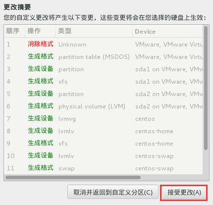

点击“**接收更改**”，安装位置就设置完成了。

#### 3、设置网络

安装时默认网络是未启用的，本人这里选择的最小安装，而且公司电脑上网配置是固定IP的。有图形界面当然简单啦，直接在这里就打开网络好了，进入命令行后有网络好操作（O(∩_∩)O哈哈~）。

选择“**Network&HOST NAME**”，配置好IP和DNS，启动网络。

#### 4、设置密码和用户

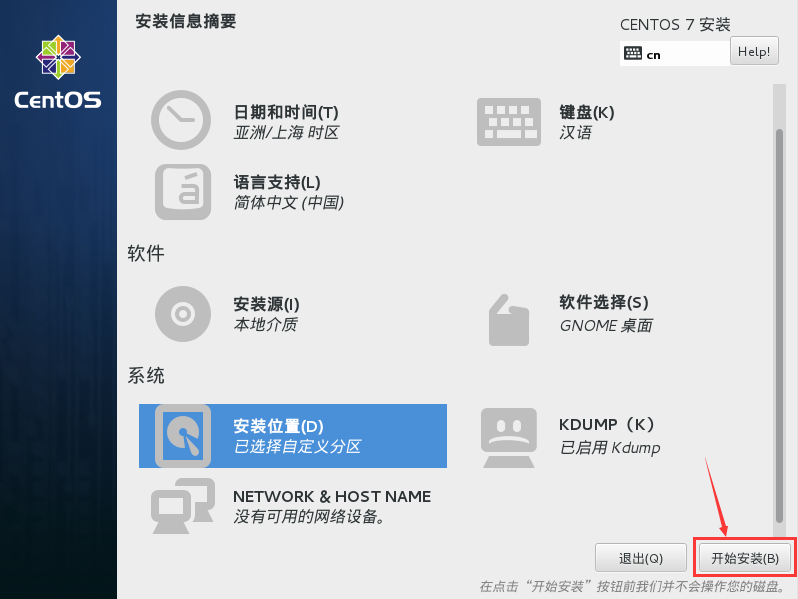

点击“**开始安装**”，安装过程中还要设置root的密码和创建用户（如果你的密码设置太简单的话，要点两次完成才能退出）。

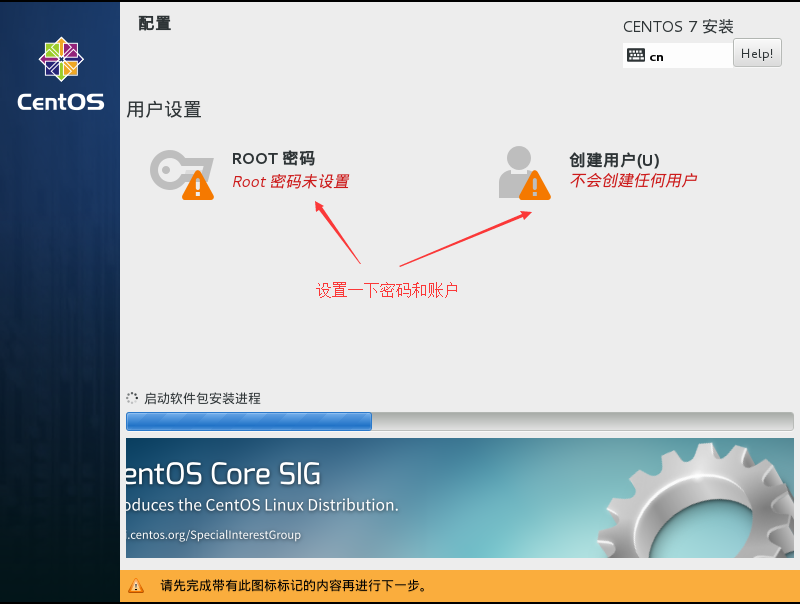

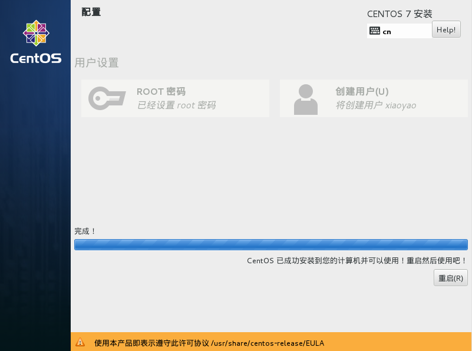


### 第五步：配置grub引导

安装过程中没有选择启动项，结果可想而知，开启电脑后咱们的Win10不见了，需要重新引导。

（网上很多都是用的Windows10下引导，需要备份恢复MBR，还要多个U盘启动盘找回Win10等步骤；其实我觉得Linux下做grub引导更简单，估计又个体差异）

#### 1、登录到CentOS

最小安装后进入的是命令行界面，因为要配置引导，所以使用root登录。


#### 2、安装ntfs-3g

要做Win10引导，先需要CentOS能够识别NTFS格式的分区，所以要先安装ntfs-3g。

（下面是段疯狂尝试的过程，不知是源失效还是公司网络原因，总是各种失败，想直接看后面的标准步骤直接点[这里](#ntfs3g)跳吧）

- yum安装ntfs-3g

  应该很简单啊，命令行输入：

  ```
  [root@localhost ~]# yum install ntfs-3g
  ```

结果提示找不到！查了一下说CentOS默认库里是没有ntfs-3g，需要增加源。

- 尝试一：yum增加源

  找不到在哪里看的了，完全没搞懂，用了这个命令：

  ```
  [root@localhost ~]# yum localinstall --nogpgcheck http://pkgs.repoforge.org/rpmforge-release/rpmforge-release-0.5.3-1.el7.rf.x86_64.rpm
  ```

没搞懂效果如何，然后试了下yum安装ntfs-3g还是找不到。

- 尝试二：yum增加阿里云的源

  ```
  [root@localhost ~]# wget -O /etc/yum.repos.d/epel.repo http://mirrors.aliyun.com/repo/epel-7.repo
  ```

发现没有wget，先安装个wget：

```
[root@localhost ~]# yum install wget
```

再次运行，提示404，找不到！

期间还运行了update更新了下yum：

```
[root@localhost ~]# yum update
```

然后想用ntfs-3g找不到，尝试用ntfs*：

```
[root@localhost ~]# yum install ntfs*
```

还是找不到……

- 尝试三：yum增加rpmforge的源

  ```
  [root@localhost ~]# wget http://pkgs.repoforge.org/rpmforge-release/rpmforge-release-0.5.3-2.el7.rf.x86_64.rpm
  ```

提示404，找不到！再尝试：

```
[root@localhost ~]# wget http://apt.sw.be/redhat/el7/en/x86_64/rpmforge/RPMS/rpmforge-release-0.5.3-1.el7.rf.x86_64.rpm
```

还是404！再尝试用rpm命令，依然无果……

最后我想，为啥必须yum安装呢……直接晚上找找直接wget了安装得了！
<span id="ntfs3g" />
###### **下面就是标准步骤：**

1. 安装wget

   ```
   [root@localhost ~]# yum install wget
   ```

2. 下载ntfs-3g压缩包

   地址可以从[官方网址](http://www.tuxera.com/community/open-source-ntfs-3g/)找到。

   ```
   [root@localhost ~]# wget https://tuxera.com/opensource/ntfs-3g_ntfsprogs-2016.2.22.tgz
   ```

3. 解压ntfs-3g压缩包

   ```
   [root@localhost ~]# tar -zxvf ntfs-3g_ntfsgrogs-2016.2.22.tgz
   ```

4. 安装gcc

   最小安装没有安装make安装的编译环境，所以先安装上gcc。

   ```
   [root@localhost ~]# yum -y install gcc
   ```

5. 配置、编译和安装ntfs-3g

   ```
   [root@localhost ~]# cd ntfs-3g_ntfsgrogs-2016.2.22
   [root@localhost ~]# ./configure
   [root@localhost ~]# make
   [root@localhost ~]# make install
   ```

终于搞定了ntfs-3g的安装了。

#### 3、自动检测引导

```
[root@localhost ~]# grub2-mkconfig -o /boot/grub2/grub.cfg
[root@localhost ~]# reboot
```

重启后Windows10就出现了。

#### 4、设置默认启动

但是默认进入是CentOS，我想让默认进入的是Windows10，那还需要几个命令。

1. 查看默认启动的内核

   ```
   [root@localhost ~]# grub2-editenv list
   ```

2. 查看所有内核

   ```
   [root@localhost ~]# cat /boot/grub2/grub.cfg | grep menuentry
   ```

   记住列出的Win10内核的名称，引号里的全部内容。

3. 修改Windows10为默认启动内核

   ```
   [root@localhost ~]# grub2-set-default '记住的名称'
   ```

4. 验证默认启动内核

   ```
   [root@localhost ~]# grub2-editenv list
   ```

再次重启看一下引导也弄好了。