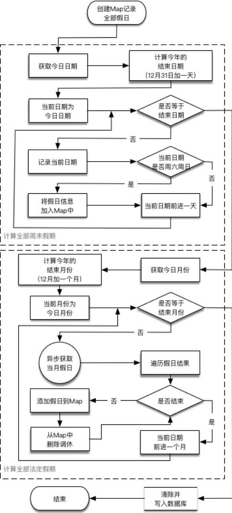
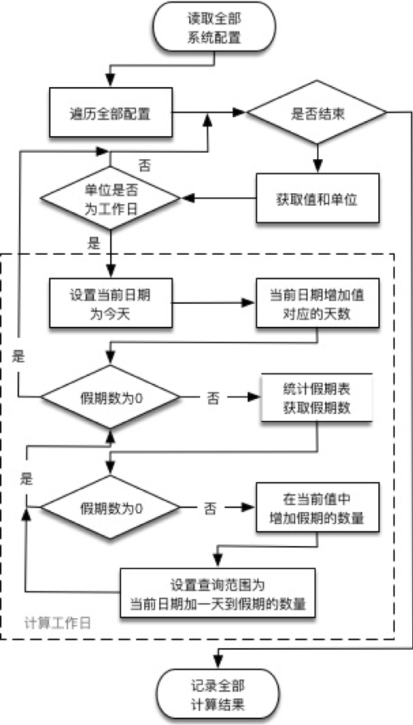

# 随笔：要求时限限制在7日

今日开发收到了一个“简单”的需求：

> “这项任务需要限制被指派者在7日内完成。”
>
> “嗯，果然简单！”
>
> “哦，客户说是7个工作日，应该好弄吧？”
>
> “好，工作日……啥！？工作日……让朕三思一下……”

站在坑里的我心里跑过……各种方法。

其实按照正常情况下，在工作日创建任务并指派，然后限期在7个工作日后则必然就是9天后（加上周末两天吗，看咱这数学^_^）。所以主要麻烦点在于“**假期调休**”！就是要解决几个问题：

- 假期调休数据来源
- 假期数据的获取及记录
- 当前日期后指定工作日后的日期计算

### 假期调休数据来源

先考虑过手动编辑，但是确实有些麻烦，网上搜索后决定使用【[聚合数据的万年历接口](https://www.juhe.cn/docs/api/id/177)】，可以免费使用。

> Tips：先要注册用户并申请使用接口获取Key，这里省略此步。

这里选择使用【获取近期假期】(http://v.juhe.cn/calendar/month)这个接口，因为它返回的内容更加详细，包括了假期中调休的日子。

> Tips：聚合数据的请求接口参数的日期格式为yyyy-M，返回数据中的日期格式为yyyy-M-d；而项目中保存时需要的是yyyy-MM-dd，要注意比对和转换。

### 假期数据的获取及记录

有了数据就可以开始开工了！

> Tips：项目实际上是个定时任务后台程序，工程采用了SpringBoot框架+MyBatis数据框架+Quartz任务调度框架。MyBatis配置和Quartz动态任务配置这些我后面其他系列的文章会有所涉及，这里就不说了。

##### 创建数据表

| 字段名   | 格式        | 说明                       |
| -------- | ----------- | -------------------------- |
| date_tag | VARCHAR(11) | 日期标识，格式为yyyy-MM-dd |
| name     | VARCHAR(64) | 假期名称                   |
| year     | INT(5)      | 所属年份                   |
| date     | DATE        | 具体日期                   |

##### 配置访问地址

在application.properties（SpringBoot框架）中增加自定义配置项：

```properties
#第三方接口
#聚合数据
other.juhe.url.holidayMonth=http://v.juhe.cn/calendar/month?key=我的Key&year-month=
```

##### 添加数据层操作（mapper）

添加数据表的操作，包括了添加、删除和获取假期数量等操作：

```java
/**
 * 对假期字典表进行处理
 * Created by maqiang on 2017/6/7.
 */
public interface HolidayMapper
{
    /**
     * 获取指定日期间的假期数量
     * @param startDate
     * @param endDate
     * @return
     */
    @Select("select count(date_tag) from c_holiday where date<=#{endDate} and date>=#{startDate}")
    Integer count(@Param("startDate") String startDate,@Param("endDate") String endDate);

    /**
     * 添加或更新一条假期记录
     *
     * @param holiday
     */
    @Insert("insert into c_holiday("+
                    "date_tag,"+
                    "name,"+
                    "year,"+
                    "date"+
                    ")VALUES("+
                    "#{holiday.date_tag},"+
                    "#{holiday.name},"+
                    "#{holiday.year},"+
                    "#{holiday.date}"+
                    ")")
    void insert(@Param("holiday") Map<String,Object> holiday);

    /**
     * 删除指定日期的假期记录
     *
     * @return
     */
    @Delete("delete from c_holiday where date_tag like concat(#{dateTag},'%')")
    void delete(@Param("dateTag") String dateTag);

    /**
     * 删除指定日期之前的全部记录
     *
     * @return
     */
    @Delete("delete from c_holiday where date<#{date}")
    void clearBefore(@Param("date") String date);
}
```

> Tips：这里使用了MyBatis的注解方式配置；未使用Bean，使用Map传递数据。

##### 添加年度假期更新服务处理

在系统启动时对假期数据进行初始化，如果现在为12月，则连明年的假日数据一起初始化。并增加定时任务每月1日定时调用此更新服务处理，具体流程如下：



> Tips：每月更新便于及时获取到假期的变化，并在12月就可以更新明年的假期数据。

> Tips：访问第三方接口使用的是apache的httpasyncclient框架。这个项目我使用的是SpringBoot+Gradle配置，因此加入支持配置为：
>
> ```groovy
> //httpClient
> compile('org.apache.httpcomponents:httpclient:4.5.3')
> compile('org.apache.httpcomponents:httpasyncclient:4.1.3')
> ```

###### 使用`@value`注解引入配置连接地址

```java
	/**
     * 万年历接口
     */
    @Value("${other.juhe.url.holidayMonth}")
    private String urlHolidayMonth;
```

###### 方法：从第三方接口异步获取月份假期详情

```java
    /**
     * 请求第三方接口获取月份法定假期详情
     *
     * @param month
     * @return
     */
    public List<Map<String,Object>> loadMonthHoliday(String month) throws Exception
    {
        //发送异步请求
        AsyncClientHttpRequestFactory asyncFactory=new HttpComponentsAsyncClientHttpRequestFactory();
        URI uri=new URI(urlHolidayMonth+month);
        AsyncClientHttpRequest asynReq=asyncFactory.createAsyncRequest(uri,HttpMethod.GET);
        ListenableFuture<ClientHttpResponse> future=asynReq.executeAsync();
        ClientHttpResponse response=future.get();

        //获取结果
        InputStream inputStream=response.getBody();
        BufferedReader reader=new BufferedReader(new InputStreamReader(inputStream,"UTF-8"));
        String strRead=null;
        StringBuffer sb=new StringBuffer();
        while((strRead=reader.readLine())!=null)
        {
            sb.append(strRead);
        }
        String result=sb.toString();

        //转成JSON
        ObjectMapper objectMapper=new ObjectMapper();
        Map<String,Object> json=objectMapper.readValue(result,Map.class);
        //解析出结果是否正确以及data内容
        Integer code=Integer.parseInt(json.get("error_code")+"");
        String reason=json.get("reason")+"";
        if(code!=0) throw new Exception(reason);

        String holiday=((Map)((Map)json.get("result")).get("data")).get("holiday")+"";
        return objectMapper.readValue(holiday,List.class);
    }
```

> Tips：注意聚合数据返回的holiday字段是个Json格式的字符串，要做一下转换。

###### 方法：生成一年的周末数据

```java
    /**
     * 生成一年的全部假期列表
     *
     * @return
     */
    public Map<String,Map<String,Object>> loadYearWeekly(final String year) throws ParseException
    {
        //获取起始日期
        final SimpleDateFormat format=new SimpleDateFormat("yyyy-MM-dd");
        String startDateString=year+"-01-01";
        String endDateString=year+"-12-31";
        Date startDate=format.parse(startDateString);

        //比较年份起始日和当前日期
        Date today=new Date();
        startDate=(today.getTime()>startDate.getTime())?today:startDate;

        //遍历全年每天，记录全部周末
        Calendar calendar=Calendar.getInstance();
        //结束日为最后一天加一天
        calendar.setTime(format.parse(endDateString));
        calendar.add(Calendar.DATE,1);
        endDateString=format.format(calendar.getTime());
        //设置开始日期
        calendar.setTime(startDate);
        String curDateString=format.format(startDate);
        Date curDate=null;
        Map<String,Map<String,Object>> result=new LinkedHashMap<>();
        while(!curDateString.equals(endDateString))
        {
            //当前日
            curDate=calendar.getTime();

            //当前日如果为周末，则记录结果
            if(calendar.get(Calendar.DAY_OF_WEEK)==Calendar.SATURDAY
                    || calendar.get(Calendar.DAY_OF_WEEK)==Calendar.SUNDAY)
            {
                final Date finalCurDate=curDate;
                result.put(format.format(finalCurDate),new LinkedHashMap()
                {{
                    put("date_tag",format.format(finalCurDate));
                    put("name","周末");
                    put("year",year);
                    put("date",finalCurDate);
                }});
            }

            //前进一天
            calendar.add(Calendar.DATE,1);
            curDateString=format.format(calendar.getTime());
        }

        return result;
    }
```

###### 方法：获取一年的全部假期数据，并从周末数据中扣除调休数据

```java
    /**
     * 通过第三方接口，生成指定年份全部法定假期；并扣除调休的周末日期
     *
     * @param year
     * @return
     * @throws Exception
     */
    public Map<String,Map<String,Object>> loadYearHoliday(String year,Map<String,Map<String,Object>> holidayList)
            throws Exception
    {
        //获取起始日期
        final SimpleDateFormat monthFormat=new SimpleDateFormat("yyyy-M");
        final SimpleDateFormat readFormat=new SimpleDateFormat("yyyy-M-d");
        final SimpleDateFormat writeFormat=new SimpleDateFormat("yyyy-MM-dd");
        String startDateString=year+"-1";
        String endDateString=year+"-12";
        Date startDate=monthFormat.parse(startDateString);

        //比较年份起始日和当前日期
        Date today=new Date();
        startDate=(today.getTime()>startDate.getTime())?today:startDate;

        //遍历全年每月，解析并记录全部法定假期
        Calendar calendar=Calendar.getInstance();
        //结束日为最后一个月加一个月
        calendar.setTime(monthFormat.parse(endDateString));
        calendar.add(Calendar.MONTH,1);
        endDateString=monthFormat.format(calendar.getTime());
        //设置开始日期
        calendar.setTime(startDate);
        String curDateString=monthFormat.format(startDate);
        while(!curDateString.equals(endDateString))
        {
            //获取当前月的法定假日
            List<Map<String,Object>> holiday=null;
            try
            {
                holiday=loadMonthHoliday(curDateString);
            }
            catch(Exception ex)
            {
                logger.error(ex.getMessage(),ex);
                holiday=null;
            }

            //解析和遍历结果
            if(holiday!=null)
            {
                for(Map<String,Object> content : holiday)
                {
                    String name=content.get("name")+"";

                    for(Map<String,Object> dateMap : ((List<Map<String,Object>>)content.get("list")))
                    {
                        int status=Integer.parseInt(dateMap.get("status")+"");
                        String dateString=dateMap.get("date")+"";
                        dateString=writeFormat.format(readFormat.parse(dateString));
                        //增加假期
                        if(status==1)
                        {
                            Map data=new LinkedHashMap();
                            data.put("date_tag",dateString);
                            data.put("name",name);
                            data.put("year",year);
                            data.put("date",writeFormat.parse(dateString));
                            holidayList.put(dateString,data);
                        }
                        //扣除调休
                        if(status==2)
                        {
                            holidayList.remove(dateString);
                        }
                    }
                }
            }

            //前进一个月
            calendar.add(Calendar.MONTH,1);
            curDateString=monthFormat.format(calendar.getTime());
        }

        return holidayList;
    }
```

方法：初始化一年的全部假期

```java
    /**
     * 载入全年的的假期
     *
     * @param year
     */
    public void loadYearAllHoliday(String year) throws Exception
    {
        logger.info("Start holiday init!");
        Map<String,Map<String,Object>> holidayMap=new LinkedHashMap<>();

        //载入当前一年的周末
        holidayMap.putAll(loadYearWeekly(year));
        logger.info("Load all week holiday("+year+"),size:"+holidayMap.size());

        //获取当前一年的全部法定假日，并清除调休
        holidayMap=loadYearHoliday(year,holidayMap);
        logger.info("Load all holiday("+year+"),size:"+holidayMap.size());

        //将全部假期结果写入数据库
        clearAndInsert(year,holidayMap);
        logger.info("Insert holiday success");
    }
    
	/**
     * 批量插入假期记录
     *
     * @param holidayMap
     */
    public void clearAndInsert(String deletePattern,Map<String,Map<String,Object>> holidayMap)
    {
        //插入前清除数据
        if(StringUtils.nonEmptyString(deletePattern))
        {
            holidayMapper.delete(deletePattern);
        }

        //插入数据
        for(Map<String,Object> holiday : holidayMap.values())
        {
            holidayMapper.insert(holiday);
        }
    }
```

###### 最后是启动时数据初始化和定时任务调用的处理

```java
	/**
     * 初始化：获取今年假期数据，初始化假期字典表
     * 再根据系统参数配置的工作日天数，计算出实际工作日+假期的天数并记录
     */
    @PostConstruct
    public void init() throws Exception
    {
        //载入今年的假期
        SimpleDateFormat format=new SimpleDateFormat("yyyy");
        String year=format.format(new Date());
        loadYearAllHoliday(year);

        //如果当前为12月，则明年的假期一起载入
        SimpleDateFormat monthFormat=new SimpleDateFormat("MM");
        String month=monthFormat.format(new Date());
        if("12".equals(month))
        {
            Calendar calendar=Calendar.getInstance();
            calendar.add(Calendar.YEAR,1);
            year=format.format(calendar.getTime());
            loadYearAllHoliday(year);
        }

        ...
    }
```

> Tips：这里代码并未写全，结尾会有代码纯净版。

这样，假期数据就全部载入并记录到数据库中，下面就要执行计算了。

### 当前日期后指定工作日后的日期计算

这里首先考虑实际上每日的7个工作日后在当天是肯定不会变的，所以不需要在每次创建任务时就跑全部流程计算日期。而是在每日凌晨时执行定时任务计算好7个工作日实际间隔的日数并保存在Redis中，这样当天创建的任务可以直接取出间隔计算限期就好了。

> Tips：同时在系统启动初始化也需计算此间隔，并记录在Redis中。

**工作日的算法**如下：


在今日日期到配置指定的工作日数量之间，统计数据库中这段时间内的假期数量，如果为0则当前指定工作日数即为实际天数；如果不为0，则实际天数为当前值增加假期数；然后再次统计增加的这段天数中的假期数量，再次处理；以此类推，直到统计假期数为0。

**计算方法流程**如下：



其实代码看着要更简单些：

```java
    /**
     * 获取指定的工作日的实际天数
     *
     * @param workDay
     * @return
     */
    public Integer calculateRealDay(Date startDate,Integer workDay)
    {
        SimpleDateFormat format=new SimpleDateFormat("yyyy-MM-dd");
        Calendar calendar=Calendar.getInstance();
        calendar.setTime(startDate);

        //循环查询假期数并增加
        Date curStartDate=startDate;
        calendar.add(Calendar.DATE,workDay.intValue());
        int holidayCount=-1;
        while(holidayCount!=0)
        {
            //查询假期表
          holidayCount=holidayMapper.count(
              format.format(curStartDate),
              format.format(calendar.getTime()));

            if(holidayCount>0)
            {
                //增加结果数
                workDay=workDay.intValue()+holidayCount;
                //转移开始日期和结束日期
                calendar.add(Calendar.DATE,1);
                curStartDate=calendar.getTime();
                calendar.add(Calendar.DATE,holidayCount-1);
            }
        }

        return workDay;
    }
```

至此，这个“简单任务”终于完成了。


### 代码纯净版

**application.properties**

```properties
#第三方接口
#聚合数据
other.juhe.url.holidayMonth=http://v.juhe.cn/calendar/month?key=我的Key&year-month=
```

**HolidayMapper.java**

```java
import org.apache.ibatis.annotations.Delete;
import org.apache.ibatis.annotations.Insert;
import org.apache.ibatis.annotations.Param;
import org.apache.ibatis.annotations.Select;

import java.util.Map;

/**
 * 对假期字典表进行处理
 * Created by maqiang on 2017/6/7.
 */
public interface HolidayMapper
{
    /**
     * 获取指定日期间的假期数量
     * @param startDate
     * @param endDate
     * @return
     */
    @Select("select count(date_tag) from c_holiday where date<=#{endDate} and date>=#{startDate}")
    Integer count(@Param("startDate") String startDate,@Param("endDate") String endDate);

    /**
     * 添加或更新一条假期记录
     *
     * @param holiday
     */
    @Insert("insert into c_holiday("+
                    "date_tag,"+
                    "name,"+
                    "year,"+
                    "date"+
                    ")VALUES("+
                    "#{holiday.date_tag},"+
                    "#{holiday.name},"+
                    "#{holiday.year},"+
                    "#{holiday.date}"+
                    ")")
    void insert(@Param("holiday") Map<String,Object> holiday);

    /**
     * 删除指定日期的假期记录
     *
     * @return
     */
    @Delete("delete from c_holiday where date_tag like concat(#{dateTag},'%')")
    void delete(@Param("dateTag") String dateTag);

    /**
     * 删除指定日期之前的全部记录
     *
     * @return
     */
    @Delete("delete from c_holiday where date<#{date}")
    void clearBefore(@Param("date") String date);
}
```

**HolidayService.java**

```java
import com.fasterxml.jackson.databind.ObjectMapper;
import com.mchange.v2.lang.StringUtils;
import org.slf4j.Logger;
import org.slf4j.LoggerFactory;
import org.springframework.beans.factory.annotation.Autowired;
import org.springframework.beans.factory.annotation.Value;
import org.springframework.http.HttpMethod;
import org.springframework.http.client.AsyncClientHttpRequest;
import org.springframework.http.client.AsyncClientHttpRequestFactory;
import org.springframework.http.client.ClientHttpResponse;
import org.springframework.http.client.HttpComponentsAsyncClientHttpRequestFactory;
import org.springframework.stereotype.Service;
import org.springframework.transaction.annotation.Transactional;
import org.springframework.ui.ModelMap;
import org.springframework.util.concurrent.ListenableFuture;
import pb.analyzer.data.platform.HolidayMapper;

import javax.annotation.PostConstruct;
import java.io.BufferedReader;
import java.io.IOException;
import java.io.InputStream;
import java.io.InputStreamReader;
import java.net.URI;
import java.text.ParseException;
import java.text.SimpleDateFormat;
import java.util.*;

/**
 * 处理假期相关的业务
 * Created by maqiang on 2017/6/7.
 */
@Transactional(rollbackFor=Exception.class)
@Service
public class HolidayService
{
    //日志
    private static final Logger logger=LoggerFactory.getLogger(HolidayService.class);

    /**
     * 假期字典表管理
     */
    @Autowired
    HolidayMapper holidayMapper;

    /**
     * Redis管理(平台业务)
     */
    @Autowired
    PlatformRedisService platformRedisService;

    /**
     * 万年历接口
     */
    @Value("${other.juhe.url.holidayMonth}")
    private String urlHolidayMonth;

    /**
     * 初始化：获取今年假期数据，初始化假期字典表
     * 再根据系统参数配置的工作日天数，计算出实际工作日+假期的天数并记录
     */
    @PostConstruct
    public void init() throws Exception
    {
        //载入今年的假期
        SimpleDateFormat format=new SimpleDateFormat("yyyy");
        String year=format.format(new Date());
        loadYearAllHoliday(year);

        //如果当前为12月，则明年的假期一起载入
        SimpleDateFormat monthFormat=new SimpleDateFormat("MM");
        String month=monthFormat.format(new Date());
        if("12".equals(month))
        {
            Calendar calendar=Calendar.getInstance();
            calendar.add(Calendar.YEAR,1);
            year=format.format(calendar.getTime());
            loadYearAllHoliday(year);
        }

        //更新系统配置天数对应的今日的真实工作日数
        updateRealDay();
        logger.info("Holiday init success!");
    }

    /**
     * 载入全年的的假期
     *
     * @param year
     */
    public void loadYearAllHoliday(String year) throws Exception
    {
        logger.info("Start holiday init!");
        Map<String,Map<String,Object>> holidayMap=new LinkedHashMap<>();

        //载入当前一年的周末
        holidayMap.putAll(loadYearWeekly(year));
        logger.info("Load all week holiday("+year+"),size:"+holidayMap.size());

        //获取当前一年的全部法定假日，并清除调休
        holidayMap=loadYearHoliday(year,holidayMap);
        logger.info("Load all holiday("+year+"),size:"+holidayMap.size());

        //将全部假期结果写入数据库
        clearAndInsert(year,holidayMap);
        logger.info("Insert holiday success");
    }

    /**
     * 生成一年的全部假期列表
     *
     * @return
     */
    public Map<String,Map<String,Object>> loadYearWeekly(final String year) throws ParseException
    {
        //获取起始日期
        final SimpleDateFormat format=new SimpleDateFormat("yyyy-MM-dd");
        String startDateString=year+"-01-01";
        String endDateString=year+"-12-31";
        Date startDate=format.parse(startDateString);

        //比较年份起始日和当前日期
        Date today=new Date();
        startDate=(today.getTime()>startDate.getTime())?today:startDate;

        //遍历全年每天，记录全部周末
        Calendar calendar=Calendar.getInstance();
        //结束日为最后一天加一天
        calendar.setTime(format.parse(endDateString));
        calendar.add(Calendar.DATE,1);
        endDateString=format.format(calendar.getTime());
        //设置开始日期
        calendar.setTime(startDate);
        String curDateString=format.format(startDate);
        Date curDate=null;
        Map<String,Map<String,Object>> result=new LinkedHashMap<>();
        while(!curDateString.equals(endDateString))
        {
            //当前日
            curDate=calendar.getTime();

            //当前日如果为周末，则记录结果
            if(calendar.get(Calendar.DAY_OF_WEEK)==Calendar.SATURDAY
                    || calendar.get(Calendar.DAY_OF_WEEK)==Calendar.SUNDAY)
            {
                final Date finalCurDate=curDate;
                result.put(format.format(finalCurDate),new LinkedHashMap()
                {{
                    put("date_tag",format.format(finalCurDate));
                    put("name","周末");
                    put("year",year);
                    put("date",finalCurDate);
                }});
            }

            //前进一天
            calendar.add(Calendar.DATE,1);
            curDateString=format.format(calendar.getTime());
        }

        return result;
    }

    /**
     * 通过第三方接口，生成指定年份全部法定假期；并扣除调休的周末日期
     *
     * @param year
     * @return
     * @throws Exception
     */
    public Map<String,Map<String,Object>> loadYearHoliday(String year,Map<String,Map<String,Object>> holidayList)
            throws Exception
    {
        //获取起始日期
        final SimpleDateFormat monthFormat=new SimpleDateFormat("yyyy-M");
        final SimpleDateFormat readFormat=new SimpleDateFormat("yyyy-M-d");
        final SimpleDateFormat writeFormat=new SimpleDateFormat("yyyy-MM-dd");
        String startDateString=year+"-1";
        String endDateString=year+"-12";
        Date startDate=monthFormat.parse(startDateString);

        //比较年份起始日和当前日期
        Date today=new Date();
        startDate=(today.getTime()>startDate.getTime())?today:startDate;

        //遍历全年每月，解析并记录全部法定假期
        Calendar calendar=Calendar.getInstance();
        //结束日为最后一个月加一个月
        calendar.setTime(monthFormat.parse(endDateString));
        calendar.add(Calendar.MONTH,1);
        endDateString=monthFormat.format(calendar.getTime());
        //设置开始日期
        calendar.setTime(startDate);
        String curDateString=monthFormat.format(startDate);
        while(!curDateString.equals(endDateString))
        {
            //获取当前月的法定假日
            List<Map<String,Object>> holiday=null;
            try
            {
                holiday=loadMonthHoliday(curDateString);
            }
            catch(Exception ex)
            {
                logger.error(ex.getMessage(),ex);
                holiday=null;
            }

            //解析和遍历结果
            if(holiday!=null)
            {
                for(Map<String,Object> content : holiday)
                {
                    String name=content.get("name")+"";

                    for(Map<String,Object> dateMap : ((List<Map<String,Object>>)content.get("list")))
                    {
                        int status=Integer.parseInt(dateMap.get("status")+"");
                        String dateString=dateMap.get("date")+"";
                        dateString=writeFormat.format(readFormat.parse(dateString));
                        //增加假期
                        if(status==1)
                        {
                            Map data=new LinkedHashMap();
                            data.put("date_tag",dateString);
                            data.put("name",name);
                            data.put("year",year);
                            data.put("date",writeFormat.parse(dateString));
                            holidayList.put(dateString,data);
                        }
                        //扣除调休
                        if(status==2)
                        {
                            holidayList.remove(dateString);
                        }
                    }
                }
            }

            //前进一个月
            calendar.add(Calendar.MONTH,1);
            curDateString=monthFormat.format(calendar.getTime());
        }

        return holidayList;
    }

    /**
     * 请求第三方接口获取月份法定假期详情
     *
     * @param month
     * @return
     */
    public List<Map<String,Object>> loadMonthHoliday(String month) throws Exception
    {
        //发送异步请求
        AsyncClientHttpRequestFactory asyncFactory=new HttpComponentsAsyncClientHttpRequestFactory();
        URI uri=new URI(urlHolidayMonth+month);
        AsyncClientHttpRequest asynReq=asyncFactory.createAsyncRequest(uri,HttpMethod.GET);
        ListenableFuture<ClientHttpResponse> future=asynReq.executeAsync();
        ClientHttpResponse response=future.get();

        //获取结果
        InputStream inputStream=response.getBody();
        BufferedReader reader=new BufferedReader(new InputStreamReader(inputStream,"UTF-8"));
        String strRead=null;
        StringBuffer sb=new StringBuffer();
        while((strRead=reader.readLine())!=null)
        {
            sb.append(strRead);
        }
        String result=sb.toString();

        //转成JSON
        ObjectMapper objectMapper=new ObjectMapper();
        Map<String,Object> json=objectMapper.readValue(result,Map.class);
        //解析出结果是否正确以及data内容
        Integer code=Integer.parseInt(json.get("error_code")+"");
        String reason=json.get("reason")+"";
        if(code!=0) throw new Exception(reason);

        String holiday=((Map)((Map)json.get("result")).get("data")).get("holiday")+"";
        return objectMapper.readValue(holiday,List.class);
    }

    /**
     * 批量插入假期记录
     *
     * @param holidayMap
     */
    public void clearAndInsert(String deletePattern,Map<String,Map<String,Object>> holidayMap)
    {
        //插入前清除数据
        if(StringUtils.nonEmptyString(deletePattern))
        {
            holidayMapper.delete(deletePattern);
        }

        //插入数据
        for(Map<String,Object> holiday : holidayMap.values())
        {
            holidayMapper.insert(holiday);
        }
    }

    /**
     * 清除今天之前的假期记录
     */
    public void clearBefore()
    {
        SimpleDateFormat format=new SimpleDateFormat("yyyy-MM-dd");
        holidayMapper.clearBefore(format.format(new Date()));
    }

    /**
     * 更新系统配置天数对应的今日的真实工作日数
     */
    public void updateRealDay() throws IOException
    {
        //Redis更新的内容自己写吧
        ...
    }

    /**
     * 获取指定的工作日的实际天数
     *
     * @param workDay
     * @return
     */
    public Integer calculateRealDay(Date startDate,Integer workDay)
    {
        SimpleDateFormat format=new SimpleDateFormat("yyyy-MM-dd");
        Calendar calendar=Calendar.getInstance();
        calendar.setTime(startDate);

        //循环查询假期数并增加
        Date curStartDate=startDate;
        calendar.add(Calendar.DATE,workDay.intValue());
        int holidayCount=-1;
        while(holidayCount!=0)
        {
            //查询假期表
            holidayCount=holidayMapper.count(
                format.format(curStartDate),
                format.format(calendar.getTime()));

            if(holidayCount>0)
            {
                //增加结果数
                workDay=workDay.intValue()+holidayCount;
                //转移开始日期和结束日期
                calendar.add(Calendar.DATE,1);
                curStartDate=calendar.getTime();
                calendar.add(Calendar.DATE,holidayCount-1);
            }
        }

        return workDay;
    }
}
```