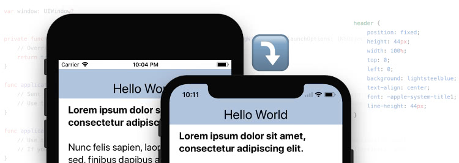
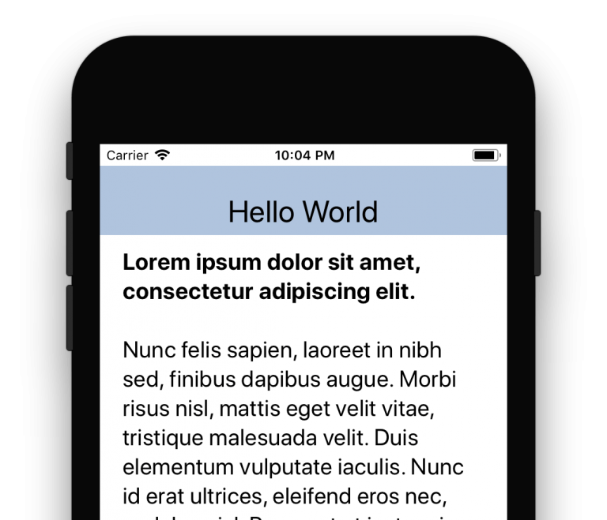
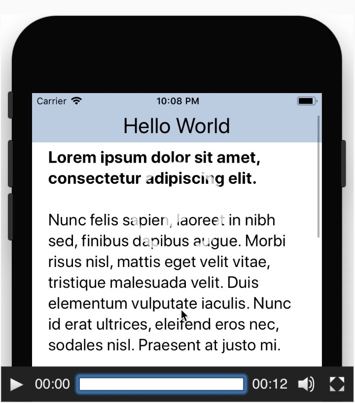
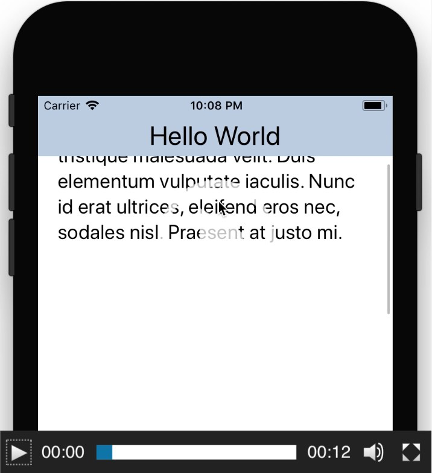
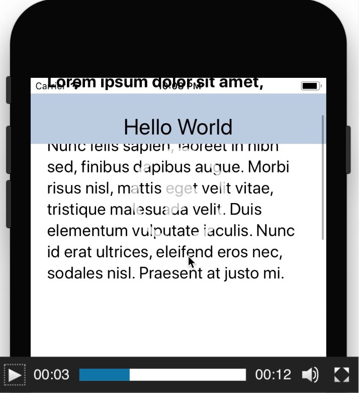
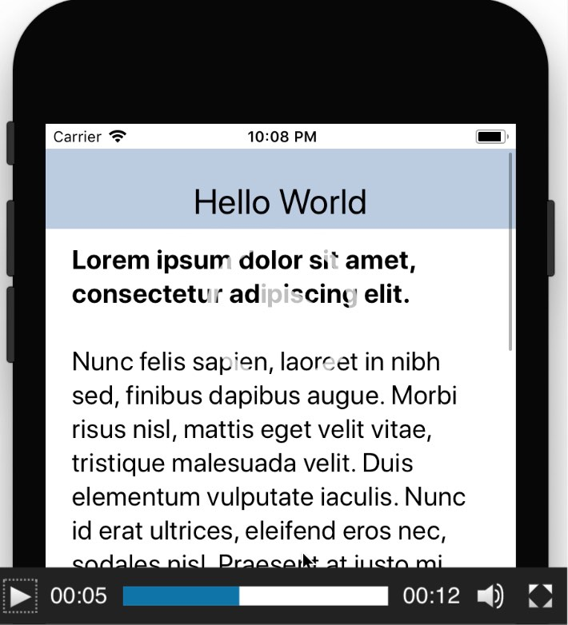
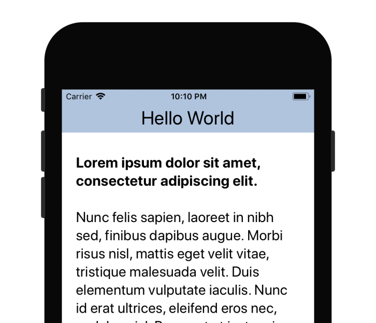
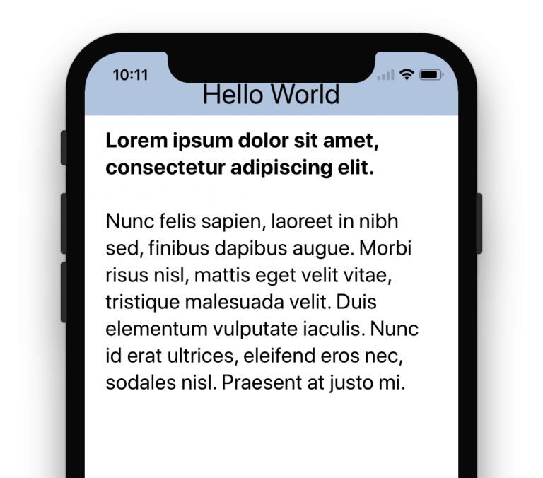
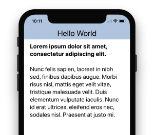

# IT译文：深入理解iOS11中的WebView

（备注：本文由本人翻译自[Darryl Pogue](https://dpogue.ca/)的[Understanding the WebView Viewport in iOS 11](https://ayogo.com/blog/ios11-viewport/)）

下面为正文内容：

------



发布于09/13/2017，作者：[Darryl Pogue](https://dpogue.ca/)

iOS11在顶部状态栏区域带来了一些新的可能不太直观的行为改变，但是这对那些使用如Apache Cordova或Ionic等工具的开发人员来说非常重要。值得说明的是，这种改变将会影响任何基于Web的使用了固定状态栏的应用程序，当开发人员意图为iOS11构建这些应用程序时。那么此篇文章将会帮助您了解iOS11中的WebView组件。

**注意：**现有的应用程序依然将正常工作，因为其内部的WebView的组件行为并未改变。这种改变只影响使用Xcode9编译适配iOS11的应用程序。

为了理解这种变化，我们来看看历史版本中状态栏的变化。

### 状态栏与安全区域

在早期版本的iOS中，状态栏仅仅是屏幕顶部不变的不可触控的黑色条。对开发人员来说状态栏不过是一个系统UI，应用程序在它下面的空间运行而已。

这种情况随着iOS7的到来有所变化，iOS7中的状态栏变成了透明的，并根据导航栏（Navigation Bar）的颜色变化而变化。它意味着如Cordova这样的WebView组件中的应用程序，必须检测运行环境的iOS版本，并将20px的内边距固定添加到页面的顶部，来保证下面内容的显示位置正确。

而在iOS7以后的版本中状态栏只是增加了一些小的修正，包括增加了额外的横幅在通话时或者后台使用地理定位时。

对于本地应用来说，这部分是通过UINavigationBar和autolayout原生控件自动处理的。这些原生组件中的布局规则会保证内容调整到适配状态栏的正确高度，从而显示在状态栏不会遮挡它们的所谓“安全区域”中。同时，如果你的导航栏（UINavigationBar）靠部对其，它的颜色就会自动延伸到状态栏后面，而形成统一的颜色。可不幸的是，对于基于Web的应用程序确不能享用这份福利。

### iOS11中的改变



iOS11中不同的是WebView中的内容现在也增加了对这个所谓的“安全区域”的支持。它意味着当你的页面中有个固定位置的标题栏元素（设置为top:0），那它在页面渲染完成后会出现在屏幕顶部的20px以下也就是对齐了状态栏的地方。但是，值得注意的是：当内容向下滚动时，内容会移动到状态栏的后面；而内容向上滚动时，将会再次跌落到状态栏的下方。（留下一个很尴尬的差距落差效果，原文是个视频，这里做了些截图。）










### 苹果为什么要这样做？

我想你应该看过了PhoneX的设计，它有着不规则的屏幕形状，在屏幕顶部切除了一块区域用来放置扬声器和相机。那么如果将页面的元素固定到真实屏幕的顶部，将会出现部分内容被放置在这块切除区域中，而导致根本无法触控使用。通过系统将它对齐到状态栏的底部，可以确保顶部标题栏中的全部内容都可以使用。

这很酷……除了现有的应用程序中出现的那20px的尴尬……

### iOS11中的修正

幸运的是，苹果为开发者提供了一种通过元标签（head中的meta）来控制这个行为的方法。更幸运的是，苹果甚至将这个修复补丁更新到了已经被放弃的UIWebView控件中。

这个可设置的属性是**viewport-fit**，它有三个可能的值：

- **contain**:视图窗口应包含全部网页内容，即内容中的固定元素将被自动包含在所谓的“安全区域”中。
- **cover**:网页中需要处理全部视图窗口即真实屏幕中的内容，即你的顶部元素可能会被遮挡，你要自己处理就像在iOS10上面一样。
- **auto**:默认值，与contain相同

因此，你要想将你的标题栏还原到最顶部在状态栏的后面，就像你在iOS10中做的，你要在你的页面的head的meta中的viewport设置中增加viewport-fit=cover。




### iPhoneX

但是对于iPhoneX这种不规则的屏幕怎么办呢？在iPhoneX上状态栏不再是20像素高，并且因为扬声器和相机的遮挡，你的标题栏将完全无法触控使用了。需要注意的是，这种情况同样会出现在固定在底部的页脚部分，它将被麦克风遮挡住。

**注意**：如果你的应用程序中使用了Launch Storyboard方式，那你的应用程序就只能使用iPhoneX的全屏幕控件。现有的应用程序将自动被显示在顶部和底部之间的矩形空间中。（这个注意不是特别理解，感觉是启动时用了Launch Storyboard，就是全屏幕显示也就是WebView可以显示全屏幕；以前编译的应用会自动夹在中间区域，无法撑满全屏）



不过幸运的是，苹果公司增加了一个方法，将这个“安全区域”的布局规范开放到了CSS中。它被作为一种常量设置被添加到了CSS中，可以通过CSS中的constant()函数来访问，并且这个函数已经被提交给了[CSS工作组](https://github.com/w3c/csswg-drafts/issues/1693)进行了标准化。

这4个常量分别为：

- constant(**safe-area-inset-top**)：获取顶部安全区域插入值（单位为像素）
- constant(**safe-area-inset-bottom**)：获取底部安全区域插入值（单位为像素）
- constant(**safe-area-inset-left**)：获取左侧安全区域插入值（单位为像素）
- constant(**safe-area-inset-right**)：获取右侧安全区域插入值（单位为像素）

而苹果还给了我们一个礼物就是这个变量也被更新到了UIWebView中。

### 使用示例

假设你的页面上有一个固定位置的标题栏，在iOS10中的设置是这样的：

```css
header {
    position: fixed;
    top: 0;
    left: 0;
    right: 0;
    height: 44px;

    padding-top: 20px; /* 状态栏高度 */
}
```

那么，要为iPhoneX或者其他iOS11的设备进行调整，你需要在页面head中的viewport meta中增加：

```html
<meta name="viewport" content=".... viewport-fit=cover">
```

更改CSS设置为：

```css
header {
    /* ... */

    /* iOS10中状态栏的高度 */
    padding-top: 20px;

    /* iOS11+中状态栏的高度 */
    padding-top: constant(safe-area-inset-top);
}
```



需要注意的是，对于不知道如何解析constant语法的旧设备来说，保留返回值是很重要的（我的理解就是指上面的padding-top:20px;）。另外，你还可以在CSS的[calc()](http://www.w3cplus.com/css3/how-to-use-css3-calc-function.html)方法中使用这些常量。

如果你有底部导航栏的话，也要记得为它设置这个样式内容。

------

（这个是笔者的鸣谢，咱也替广大开发者谢谢了！）

特此感谢苹果公司的WebKit团队的Timothy Horton研发了本文提到的viewport-fit和constant()功能。感谢Shazron，Julio，Kerri，Greg和Mike在测试和验证中提供的贡献。

（译文完毕！）